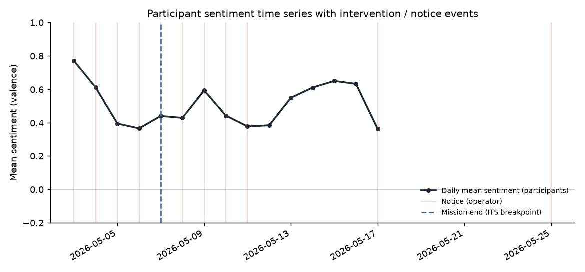
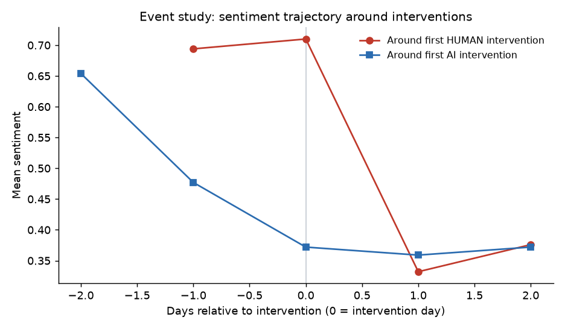
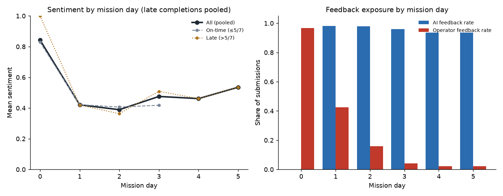

# 떠먹이 2기 감성 분석 — 연구 & 방법론 정리

> 데이터 구조 · 전처리 · 분석 방법 · 결과를 처음 보는 사람도 이해하도록 정리했습니다. 플로우(Part 0 → 4) 순서 그대로.

> 🟢 **딱 한 문장 요약**
> “인간(운영자) 개입이 사용자 기분을 나쁘게 한다”처럼 보였지만 알고 보니 **착시**였고, 제대로 분석하니 **개입 효과는 없었다.** 그 착시의 정체를 밝힌 것이 이 연구의 핵심이다.

> 🖼 **이미지** — 본문에 그림 3개(`fig1` / `fig2` / `fig3`)가 참조돼 있습니다. 노션에 넣을 때는 해당 위치에 함께 받은 이미지 파일을 끌어다 놓으세요. (GitHub에서는 자동으로 보입니다.)

---

## 1. 이 데이터는 어떻게 생겼나 (데이터 구조)

“떠먹이(클로드코드 논문챌린지 2기)”는 참가자가 **5일 미션**을 하며 게시판에 글을 올리면, **AI 튜터**와 **운영자(사람)** 가 댓글로 도와주는 서비스다. 이 활동 로그가 **가명화된 CSV 11개**로 저장돼 있다.

| 파일 | 무엇 | 행 수 |
|---|---|---|
| users.csv | 참가자 명단·팀·완료 여부 | 75 (학생 70) |
| assignments_posts.csv | 미션 **제출글** | 384 |
| assignments_comments.csv | 제출글에 달린 **댓글** (AI/운영자/참가자) | 396 |
| qna_posts / qna_comments | 질문글 / 답변 | 89 / 162 |
| notices.csv | 운영자 **공지** | 17 |
| collective_posts.csv | 집단지성 게시글 | 16 |
| events_long.csv | 위 글·댓글을 **하나로 합친 통합 표** | 1,064 |
| student_day_panel.csv | **사용자 × 날짜** 분석용 표 | 1,800 |

**모든 글·댓글에는 세 종류의 정보가 이미 붙어 있다:**
- **누가 썼나 (actor_type)** — AI 튜터 / 운영자(인간) / 참가자. *(통합표 기준: 참가자 502 · 운영자 315 · AI 247)*
- **기분 점수 (sentiment)** — 글의 감정을 **−1(부정) ~ +1(긍정)** 로 매긴 값 + 긍/부정 단어수 + 글자수 + 주제 태그(설치·사용법·토큰한도·에러 등)
- **시간** — 작성 시각(타임스탬프)과 **미션Day(0~5)** 태그

> 📌 **분석의 “한 줄(row)”이 무엇인가 — 두 가지 방식**
> ① **사용자 × 날짜**(달력 기준) · ② **사용자 × 미션Day**(Day0~5, 늦게 한 사람도 같은 Day끼리 묶음). 이 연구는 둘 다 써서 결론이 같은지 확인했다.

**실제 데이터 미리보기** (`events_long.csv`에서 컬럼 3개 발췌·가명화):

| actor_type (누가) | text_clean (글 앞부분) | sentiment_score (기분) | 쓰임 |
|---|---|---|---|
| participant | “이제 잘 보이는 것 같습니다. 감사합니다!” | **+1.00** | **Y** (기분) |
| participant | “원래 클로드코드를 쓰고 있었는데 로그인이 자꾸…” | **−0.20** | **Y** (기분) |
| ai_tutor | “안녕하세요. 조배정 다시 드렸습니다 :) 확인해보시겠어요?” | — | 개입 **X₂** |

→ **같은 형식이지만 ‘누가 썼나’로 역할이 갈린다**: 참가자 글은 결과(Y=기분), AI·운영자 글은 원인(X=개입).

---

## 2. 데이터를 어떻게 손질했나 (전처리)

원본 로그를 그대로 분석하면 안 된다. 아래 6단계로 정리했다.

1. **운영자(관리자) 제외** — 분석 대상은 **학생 70명**. 운영진 5명은 뺐다.
2. **결과변수 Y 정하기** — 기분(Y)은 **참가자가 쓴 글**로만 측정. AI·운영자가 쓴 글은 기분이 아니라 **‘개입(X)’** 으로 분리한다. *(감정의 ‘대상’을 나누는 것 = 대상 기반 분석)*
3. **🚨 오염 데이터 제거** — 2026-05-25에 시스템이 자동 생성한 **JSON 45건**(`{"version":…}` 형태, day=999)이 참가자 글로 잘못 섞여 있었다. 사람이 쓴 글이 아니라 **가짜 기분점수(0.677)** 를 만들어냈으므로 제외. **참가자 글 502 → 457건, 활동일 289 → 244건.**
4. **감성 재측정 (더 제대로 된 도구로)** — 원본에 딸린 *간이* 점수 대신 **KNU 한국어 감성사전(14,854 단어)** + 형태소분석(Okt) + **부정어 처리**(“안/못/않다” 뒤 단어는 부호 뒤집기)로 다시 매겼다. −1~+1로 정규화. *커버리지 97%, 간이 점수와 상관 r=.56 → 서로 다른 도구인데 방향 일치.*
5. **분석용 표(패널) 만들기** — (a) **달력 패널**: 사용자×날짜에 개입 여부·직전 기분 등을 붙임. (b) **미션Day 패널**: 제출을 Day0~5로 묶어 **늦게 한 제출까지 포함**(총 307건). 제출별 피드백은 그 글이 받은 AI/운영자 댓글 수로 직접 측정.
6. **변수 만들기** — **Y**=기분, **X₁**=운영자 개입(받은 댓글 유무), **X₂**=AI 개입, **통제**=시간 흐름·요일·글 길이·**직전 기분**·미션Day·사용자.

> **원본 이벤트 1,064건 → (관리자·오염 제거, 참가자만) → 기분 데이터 Y 457건 · 활동 244 user-day · 미션 제출 307건**

---

## 3. 분석 방법 6가지 — 처음 보는 사람도 이해하게

> **왜 방법이 여러 개인가** — 실험이 아닌 **관찰 데이터**는 한 가지 방법만으론 못 믿는다. 그래서 **서로 다른 방식으로 같은 결론이 나오는지(삼각검증)** 확인한다. 아래가 그 도구 상자다.

| 방법 | 쉽게 말하면 | 이 연구에서 |
|---|---|---|
| **ITS** (단절적 시계열) | 개입 전후로 **시간 추세가 끊기거나 바뀌었는지** 비교 | ✅ **사용** — 미션 종료를 기준점으로 |
| **분포시차** (Distributed Lag) | 효과가 **며칠 뒤까지 누적/지연**되어 나타나는지 | ✅ **사용** — 당일+전일 개입 |
| **FE** (고정효과) | 같은 사람/집단 안에서 **안 변하는 특성을 통제**하고 전후 변화 비교 | ✅ **사용** — 사용자·날짜 고정효과 |
| **PSM** (성향점수매칭) | **비슷한 애들끼리 짝지어** 비교 (개입 받을 확률이 비슷한 날끼리) | ✅ **사용** |
| **DID** (이중차분) | **동일 추세 안에서 집단 간 전후 비교** (개입받은 집단 vs 안 받은 집단의 변화 차이) | ⚠️ **대체** — 처치·대조 구분이 애매해 FE·이벤트스터디로 대신 |
| **SEM** (구조방정식) | **여러 변수 간 관계 구조를 한 번에** (예: AI다움→기분→지속 경로) | 🔵 **다음 단계** — 매개효과 분석용 |

※ 이 밖에 **개입 전후 t-test**(전·후 평균 비교), **교차상관**(며칠 뒤 관계), **Granger**(개입이 기분을 예측하나)도 보조로 사용.

---

## Part 0. 문제 재정의 — “변인이 떡져 있다”는 포기 사유가 아니다

> 🟢 **쉽게 말하면** — 데이터엔 ‘사람 개입’과 ‘AI다움’이 뒤섞여 있다. 학생들은 “섞여서 못 쓴다”고 걱정했지만, 교수님은 “실제 데이터는 원래 섞여 있고, **섞인 걸 통계로 떼어내는 방법**이 있다”고 했다. 그 방법(위 3번의 도구들)을 쓰는 게 이 연구다.

| 기호 | 이름 | 이 데이터에서 | 측정? |
|---|---|---|---|
| **Y** | 사용자 기분(감성) | 참가자 글의 감성 점수 | ✅ |
| **X₁** | 사람(운영자) 개입 | 운영자 댓글·공지 | ✅ |
| **X₂** | AI의 인간다움 | AI 답변을 점수화 | ⚠️ 원자료에 없음 |
| 통제 | 방해 요인 | 시간·요일·글길이·직전 기분 | ✅ |

---

## Part 1. 감성 분석 — 글을 숫자로 바꾸기

> 🟢 **쉽게 말하면** — 문장 속 **감정 단어**를 사전에서 찾아 점수를 매긴다. 긍정 단어는 +, 부정 단어는 −. 그 평균이 그 글의 기분 점수(−1~+1)가 된다.

**어떤 단어에 긍정/부정을 매기나 — 실제 채점 예시** (KNU 감성사전):

| 문장 | 사전이 잡은 단어 (점수) | 최종 |
|---|---|---|
| “너무 **어렵고** **답답**해서 **포기**하고 싶었어요” | 어렵다 −2 · 답답하다 −1 · 포기 −1 | **−0.67** |
| “드디어 완료해서 정말 **뿌듯**하고 재밌었어요” | 뿌듯하다 +2 | **+1.00** |
| “생각보다 **안** 어려웠어요” | 어렵다 −2 → **+2** (앞의 “안” 때문에 뒤집힘) | **+1.00** |

※ 세 번째가 핵심 — “안 어렵다”는 부정 단어(어렵다)지만 **부정어(안)** 가 앞에 붙어 **긍정으로 뒤집는다.** 이런 처리를 해야 한국어 감성이 정확해진다.

**이 점수, 믿을 만한가?** 감성어 커버리지 97% · 도움요청(Q&A) 글이 과제 글보다 확실히 덜 긍정적(+0.09 ≪ +0.51) → **상식과 맞음 = 타당.**

---

## Part 2. 시차 분석 — 개입 “뒤에”, 시간이 지나며 기분이 어떻게 변하나

> 🟢 **쉽게 말하면** — 개입 효과는 바로 안 나타날 수 있어서 “며칠 뒤” 기분을 본다.

> ⚠️ **핵심** — 개입 **바로 다음**만 보면 기분이 **−0.195 떨어진 것처럼** 보인다. 하지만 시간을 제대로 넣으면 그 하락은 **사라진다.**

- **며칠 뒤까지 누적 효과를 보면**(분포시차) → **+0.044, 효과 없음**
- **전체 시간 흐름 속 추세를 보면**(ITS) → 개입 뒤 하락이 아니라 **오히려 상승**
- **개입이 이후 기분을 예측하나**(Granger) → **예측 못 함**

즉 “개입 직후 하락”은 시간을 무시해서 생긴 **착시**. (각 방법 뜻은 위 3번 표 참고)

📷 **그림 ① · 날짜별 사용자 기분 시계열**

*세로선 = 운영자 공지, 파란 점선 = 미션 종료. 종료 이후 남은 참가자 기분은 오히려 상승(생존자 효과).*

---

## Part 3. 변인 분리 — 섞인 두 원인을 통계로 떼어내기 (이 연구의 심장)

> 🟢 **쉽게 말하면** — ‘사람 개입’과 ‘AI’를 한 계산에 같이 넣으면 각각의 **순수한 효과**가 나온다. 방해 요인(시간·직전 기분 등)을 통제하면 착시가 걷힌다.

**방법을 강하게 할수록(FE·PSM) 개입 효과가 0으로 수렴:**

| 방법 | 인간 개입 효과 | 유의성 |
|---|---|---|
| 순진한 전후 비교 | −0.195 | 유의 (p=.004) |
| 다중회귀 | +0.003 | 없음 (.94) |
| 고정효과(FE) | −0.069 | 없음 (.34) |
| **성향점수매칭(PSM)** | **−0.002** | **없음 (.98)** |

📷 **그림 ② · 개입 전후 기분 (평균회귀의 지문)**

*개입일(0)에 기분 최고 → 다음 날 급락. 인간(빨강)·AI(파랑)가 **똑같이** 떨어진다 → 개입 탓이 아니라 자연스러운 되돌아옴(평균회귀).*

---

## Part 3+. 미션Day 취합 — 늦게 한 참가자까지 포함 (가장 깨끗한 관점)

> 🟢 **쉽게 말하면** — 사람마다 미션 한 날짜는 달라도 **Day1~5 내용은 똑같다.** 그래서 날짜 대신 **미션Day 기준**으로 모으면 늦게 한 사람(전체의 **53%**!)까지 살리고 같은 내용끼리 비교한다.

| 미션Day | 제출 | 기분 | AI 도움율 | 운영자 도움율 |
|---|---|---|---|---|
| Day0 | 61 | **0.843** | 0% | **97%** |
| Day1 | 54 | 0.421 | 98% | 43% |
| Day2 | 50 | 0.389 | 98% | 16% |
| Day3 | 49 | 0.475 | 96% | 4% |
| Day5 | 46 | 0.535 | 94% | 2% |

> 📌 **착시의 정체** — 운영자(사람)는 **Day0에 몰빵**으로 도와주는데 **Day0 기분이 원래 최고**(신기함)다. 그 뒤 자연스럽게 내려간다 → “사람이 도와주면 기분이 나빠진다”처럼 **보이는** 착시. 미션Day를 통제하면 개입 효과 사라짐(운영자 p=.56). 같은 Day에서 제때 vs 늦게 기분이 같음(Day1 p=.97) → **늦게 한 데이터 함께 써도 됨.**

📷 **그림 ③ · 미션Day별 기분 & 피드백 노출**

*(왼쪽) 제때·늦게 기분 곡선이 거의 겹침. (오른쪽) 운영자 도움은 Day0에 몰빵, AI는 전 구간 일정.*

---

## Part 4. 워크플로우 & 결론

**진행 현황:** 데이터 정제 ✅ · 인간개입 표시(X₁) ✅ · **AI 인간다움(X₂) ⚠️ 아직** · 감성 측정(Y) ✅ 간이→KNU · 분석(FE·PSM·시차·미션Day) ✅ · 보고 ✅

> 🎯 **결론**
> ① **2기 데이터는 버리지 않는다.** 지금 결과만으로도 “관찰 데이터를 대충 보면 틀린 결론이 나온다”는 방법론 논문이 된다.
> ② **인간 vs AI 중 뭐가 더 효과적인가**는 2기만으론 못 가른다(개입이 Day0에 몰려서) → **3·4기 통제 실험(Study 2).**
> ③ 구조: **Study 1(2기 관찰) + Study 2(3·4기 실험)** 다중연구 논문.

**다음 할 일**
- [ ] 감성 재측정 — KcELECTRA/LLM + 사람 검증 (최우선)
- [ ] AI 인간다움(X₂) 사람이 직접 코딩
- [ ] 3·4기 통제 실험 설계 (+ 매개효과는 SEM으로)

---

> **데이터·측정 신뢰성 노트**
> **미션 기간:** 공식 5일(05-03~05-07) + 팔로우업(~05-28), 분석은 미션Day 기준으로 늦은 제출까지 취합.
> **측정 강건성:** 간이→정식 KNU 사전으로 바꿔도 결론 동일(순진한 효과조차 비유의 −0.074, p=.13) → **결론이 측정 도구 때문에 나온 게 아니다.**

*재현 코드: `analysis/full_pipeline.py` · `knu_reanalysis.py` · `mission_day_analysis.py` | 원본 참가자 데이터는 저장소에 포함하지 않음.*
